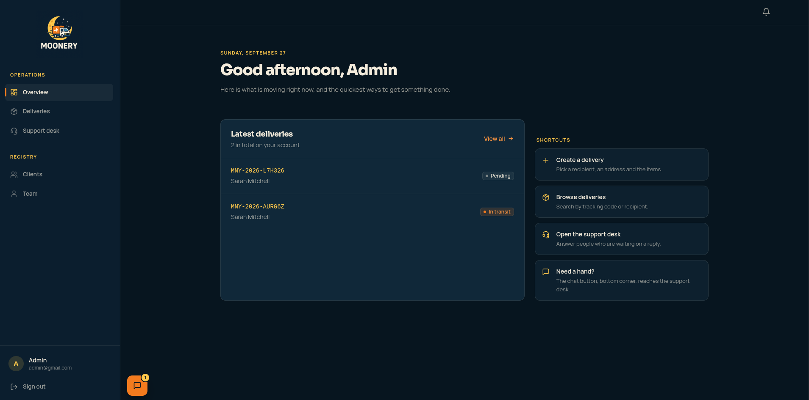
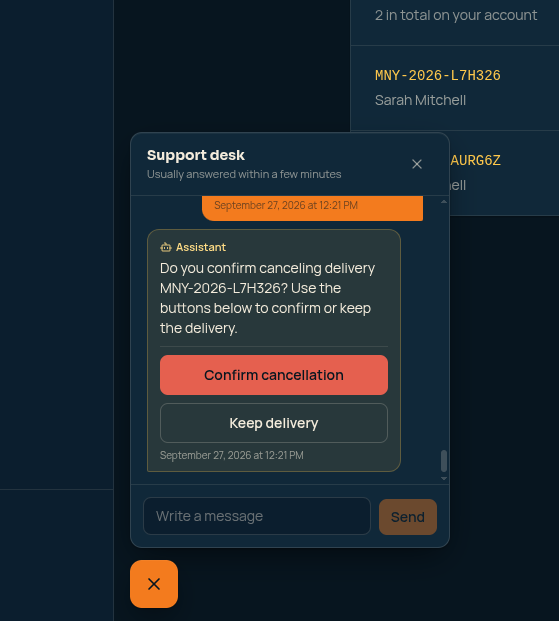
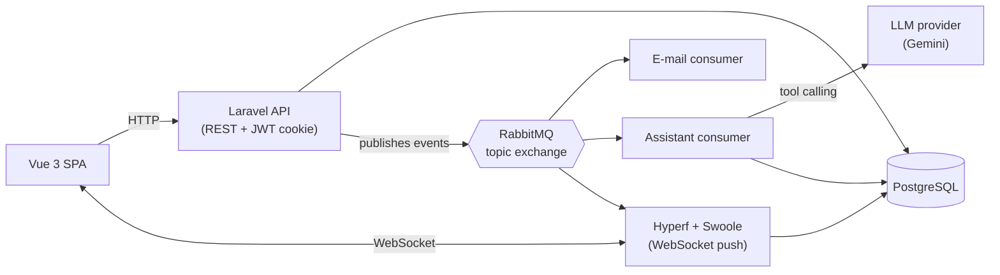

<div align="center">

# 🌙 Moonery

**A delivery management platform, built to show how a backend holds up in practice:<br/>state machines, event-driven messaging, real-time push and an AI assistant that is safe by construction.**


**[▶ Start here: run it in 5 minutes](https://github.com/moonery-system/infra)** ·
[API](https://github.com/moonery-system/api) ·
[WebSocket service](https://github.com/moonery-system/websocket-api) ·
[Frontend](https://github.com/moonery-system/frontend)

</div>

---

## Screenshots

<table>
<tr>
<td width="50%">

**Admin overview** — deliveries at a glance, status at a color


</td>
<td width="50%">

**The AI assistant, mid-cancellation** — the confirmation is a fixed message and two buttons; the model never gets to decide it


</td>
</tr>
</table>

More screenshots — the delivery state machine, the assistant answering a status question, and the support desk closing the loop — are in the [**frontend README**](https://github.com/moonery-system/frontend#readme).

## What is it?

Moonery models the whole life of a package delivery. An **admin** registers clients and deliveries, **delivery men** take a delivery and move it forward, **clients** follow it live and talk to **support**, and an **AI assistant** answers *"where is my delivery?"* before a human has to.

It is a portfolio project: the goal is **well-argued engineering decisions**, not a long feature list. Every decision below is written down in the code or in the docs.

| Who | What they do |
|---|---|
| **Admin** | Manages users, clients and deliveries; assigns and cancels |
| **Client** | Receives deliveries, follows them live, cancels before pickup, chats with support |
| **Delivery man** | Takes a free delivery, advances its status, reports failures and returns |
| **Support** | Answers chats, reads all deliveries, can cancel as support |

## Architecture at a glance



## Repositories

| Repository | What is in it | Stack |
|---|---|---|
| [**infra**](https://github.com/moonery-system/infra) ← *start here* | Docker Compose for the whole stack, getting started, the engineering handbook | Docker, Nginx, Mailpit |
| [**api**](https://github.com/moonery-system/api) | REST API, delivery state machine, e-mail and AI-assistant consumers | Laravel 9, PostgreSQL, RabbitMQ |
| [**websocket-api**](https://github.com/moonery-system/websocket-api) | Real-time push (notifications and chat) | Hyperf, Swoole |
| [**frontend**](https://github.com/moonery-system/frontend) | Single-page app for all four roles | Vue 3, TypeScript, Tailwind |

## Engineering decisions worth a look

1. **One table decides every status change.** Three independent questions: *may you do this kind of action?* (route permission), *is this move legal from the current state?* (transition table), *is this delivery yours?* (ownership check). No role-name checks in the transition logic. → [`DeliveryTransitionValidator`](https://github.com/moonery-system/api/blob/master/app/Services/DeliveryTransitionValidator.php)
2. **Two delivery men can never take the same delivery.** A conditional `UPDATE … WHERE delivery_man_id IS NULL` and a check of the affected rows, instead of read-then-write, which would lose the race.
3. **Authorization by permission, never by role name.** Adding a role is mostly data (permission rows), not new branches in the code.
4. **Claim-check messaging.** Events carry only ids; consumers re-read the data. *Who* receives a chat message is decided once, in the API, so the authorization rules never exist in two services.
5. **WebSocket authenticated with the same httpOnly JWT cookie**, refused at `onOpen`. No token in URLs or logs.
6. **An immutable delivery timeline.** A history row is written at each of the five places that change a status (an ORM observer would silently miss query-builder updates).
7. **Support chat where "unread" follows the direction of the message**, because any agent may answer, so "who read it" is not a usable key.
8. **An AI assistant that is safe by construction** (next section).
9. **Static analysis at level 5 in both backends, with no baseline**, and tests that never touch the network or need an API key.

## The AI assistant, in 30 seconds

- A customer asks in the support chat: *"Where is my delivery?"*, *"Can I cancel it?"*
- The assistant answers through **tool calling** over that customer's data only. The scope lives in the **tool code, not in the prompt**, and the user identity never comes from the model's arguments. A weaker model cannot open a hole.
- **Cancelling is not a tool.** The assistant can only *ask*; the customer confirms through an endpoint that runs the same business rule as a manual cancel.
- Any failure, limit or doubt ends the same way: a fixed fallback message and a **hand-off to a human**. When a human replies, the bot goes quiet.
- Provider-neutral `LlmClient` (Gemini over plain REST today, no SDK) with a guard for retries, spacing and daily caps on free-tier quotas.
- Built with **Claude Code** from an architecture plan I reviewed step by step. The [decision log](https://github.com/moonery-system/api/blob/master/docs/assistant-decision-log.md) records what actually went wrong along the way: a prompt that lacked a status glossary, a seeder that passed the tests and failed on a real database, and a race in the confirmation step that only mutation testing exposed.

## Quality signals

| | Tests | Static analysis | CI |
|---|---|---|---|
| **api** | 136 feature tests (delivery rules, authorization, chat, assistant), no network, no API key | PHPStan level 5, no baseline | tests + lint + static analysis |
| **websocket-api** | none yet | PHPStan level 5, no baseline | static analysis |
| **frontend** | 96 unit tests for the TypeScript logic (components are not covered yet) | ESLint, 0 errors | — |

## Run it locally

```bash
git clone https://github.com/moonery-system/infra.git moonery && cd moonery
# then follow the getting-started steps in the infra README
docker compose up -d
```

Full instructions, seeded logins and a "try this" tour are in the [**infra README**](https://github.com/moonery-system/infra#readme).

## Honest gaps (what I would do next)

- **Retry and dead-letter queues for the consumers.** Today a failed e-mail is logged and dropped.
- Tests for the WebSocket service and for the Vue components.
- Upgrade Laravel 9 to a supported release.
- A read-side for the audit log (it is written, but nothing shows it).

## About

Built by **João Gabriel Sena**, a backend-focused full-stack developer (PHP/Laravel, Vue, event-driven systems). Open to backend and full-stack roles.
[LinkedIn](https://www.linkedin.com/in/joaosenapassos) · [GitHub](https://github.com/js3na)

<details>
<summary><b>🇧🇷 Resumo em português</b></summary>

**Moonery** é uma plataforma de gestão de entregas feita para mostrar decisões de arquitetura de backend: máquina de estados, mensageria orientada a eventos, push em tempo real e um assistente de IA seguro por construção.

- **API** em Laravel 9 + PostgreSQL + RabbitMQ, **WebSocket** em Hyperf/Swoole e **frontend** em Vue 3 + TypeScript.
- Quatro papéis (admin, cliente, entregador, suporte) e um **assistente de IA** no chat que responde sobre as entregas do próprio cliente. O escopo de dados está no código das ferramentas (não no prompt), o cancelamento exige confirmação do usuário e qualquer falha encaminha a conversa a um humano.
- 136 testes de feature na API, 96 testes unitários no frontend, PHPStan nível 5 nos dois backends e CI.
- Para rodar: comece pelo repositório [**infra**](https://github.com/moonery-system/infra). O manual técnico do projeto (`CLAUDE.md`) está em português.

</details>
